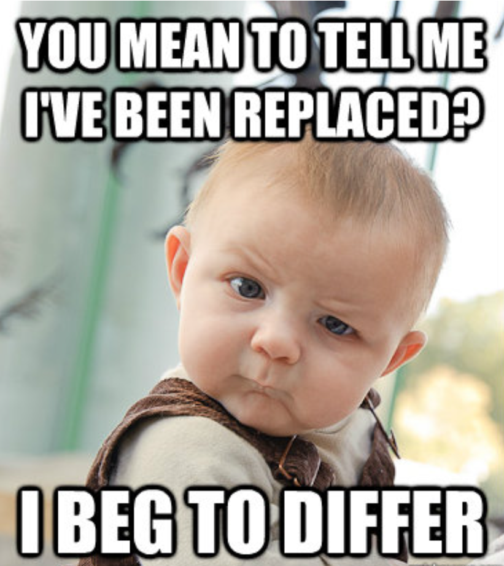

```{r setup, include=FALSE}
knitr::opts_chunk$set(echo = TRUE)

library(kableExtra)
```

```{r, echo = F}
bfcolor <- function(x, color) {
  if (knitr::is_latex_output()) {
    sprintf("\\textcolor{%s}{\\textbf{%s}}", color, x)
  } else if (knitr::is_html_output()) {
    sprintf("<span style='color: %s;'><b>%s</b></span>", color, x)
  } else x
}

```

---

# Instructions for Submission

- The submission portal on Canvas is back to having 2 questions:
    - One for uploading your `.html` file 
    - One for uploading your `.zip` file containing both the `.html` and `.Rmd` files (along with any relevant datasets/images) 
- Remember to **rename** your `.Rmd` file as `Homework08_yournetid.Rmd`
- Remember to always copy the necessary files to your `workingfiles` folder; never edit and/or knit the files directly in the `10-content` folder.
- The final question in this homework does not require any coding, but you should still typeset your answers into the `.Rmd` file. (You will still only submit one `.html` file to Canvas.)
- Please complete the survey appearing at the end. 

\

---

# Introduction

## Lahman baseball database

Extensive baseball data is freely available all the way back to the 1871 season. We're going to use a `SQLite` version of the a particular database containing information on various seasons of baseball up to the 2019 season, put together by Jeff Knecht, at https://www.seanlahman.com/baseball-archive/statistics/. We have also made the database available to you on the class server, in a file called `2019_lahmansbaseballdb.sqlite` located in your `data` folder. \

Throughout this homework, you may find it useful to consult the Database Description associated with this database. It can be found at this url: https://www.seanlahman.com/files/database/readme2019.txt


\

---

# Exercises

## Exercise 0: YAML

Update the YAML to reflect your own information (i.e. name, collaborators, etc.). If you did not collaborate with anyone, note that down in the YAML. 


\

---

## Exercise 1: Glossary of Functions

Fill in the following table with the functions you learned in Lecture 13 and 14 this week. Add as many lines as you feel are necessary (remember that Worksheet 0 covered how to add rows to tables in Markdown).

`r bfcolor("Solutions:", "blue")`


| *`R` Function* | *Description of Function* | *Example of the Function* |
|------|-------|-------|
| `Function Name` | Function Description | `Function Example` |


\

---


## Exercise 2: Connecting to the database

Load the necessary packages and open a connection named `lahman_db_2019` to the Lahman 2019 season database housed in the `sqlite` file in the data folder.

`r bfcolor("Solutions:", "blue")`

```{r}
# Write your code here

```


\

---

## Exercise 3: Getting to know your database

**(a)** List all relations in the database

`r bfcolor("Solutions:", "blue")`

```{r}
# Write your code here

```


\

**(b)** Consider the relation named `Batting`. Save it as a data frame in your `R` session, called `batting_2019`. Check that `batting_2019` is indeed a data frame. What is its dimension? 

`r bfcolor("Solutions:", "blue")`

```{r}
# Write your code here

```


\

**(c)**  Remove `eval=FALSE` from the `R` code chunks below and run the code chunks. Then, after each SQL query (each call to `dbGetQuery()`) has executed, explain in words what is being extracted.


`r bfcolor("&nbsp;&nbsp;&nbsp;&nbsp; (i)", "black")`
    
```{r, eval = FALSE}
dbGetQuery(lahman_db_2019,
           "SELECT playerID, yearID, AB, H, HR
           FROM Batting
           ORDER BY yearID
           LIMIT 10"
)
```

`r bfcolor("Solutions:", "blue")`

**Replace this line with your answers.**


\


`r bfcolor("&nbsp;&nbsp;&nbsp;&nbsp; (ii)", "black")`

```{r, eval = FALSE}
dbGetQuery(lahman_db_2019,
           "SELECT playerID, yearID, AB, H, HR
           FROM Batting
           ORDER BY HR DESC
           LIMIT 10"
)
```

`r bfcolor("Solutions:", "blue")`

**Replace this line with your answers.**


\

`r bfcolor("&nbsp;&nbsp;&nbsp;&nbsp; (iii)", "black")`

```{r, eval = FALSE}
dbGetQuery(lahman_db_2019,
           "SELECT playerID, yearID, AB, H, HR
           FROM Batting
           WHERE HR > 50
           ORDER BY HR DESC"
)
```

`r bfcolor("Solutions:", "blue")`

**Replace this line with your answers.**


\

`r bfcolor("&nbsp;&nbsp;&nbsp;&nbsp; (iv)", "black")`

```{r, eval = FALSE}
dbGetQuery(lahman_db_2019,
           "SELECT playerID, yearID, AB, H, HR
           FROM Batting
           WHERE yearID >= 1999 AND yearID <= 2009
           ORDER BY HR DESC
           LIMIT 10"
)
```

`r bfcolor("Solutions:", "blue")`

**Replace this line with your answers.**


\

---


## Exercise 4: SQL computations


**(a)** As before, remove `eval=FALSE` from the following `R` code chunks. Then, after each SQL query, explain in words what is being extracted. 


`r bfcolor("&nbsp;&nbsp;&nbsp;&nbsp; (i)", "black")`

```{r, eval = FALSE}
dbGetQuery(lahman_db_2019, 
           "SELECT AVG(HR)
           FROM BATTING"
)
           
```

`r bfcolor("Solutions:", "blue")`

**Replace this line with your answers.**


\


`r bfcolor("&nbsp;&nbsp;&nbsp;&nbsp; (ii)", "black")`

```{r, eval = FALSE}
dbGetQuery(lahman_db_2019,
           "SELECT SUM(HR)
           FROM BATTING"
)
```

`r bfcolor("Solutions:", "blue")`

**Replace this line with your answers.**


\


`r bfcolor("&nbsp;&nbsp;&nbsp;&nbsp; (iii)", "black")`

```{r, eval = FALSE}
dbGetQuery(lahman_db_2019,
           "SELECT playerID, yearID, teamID, MAX(HR)
           FROM BATTING"
)
```

`r bfcolor("Solutions:", "blue")`

**Replace this line with your answers.**


\

`r bfcolor("&nbsp;&nbsp;&nbsp;&nbsp; (iv)", "black")`

```{r, eval = FALSE}
dbGetQuery(lahman_db_2019,
           "SELECT AVG (HR)
           FROM BATTING
           WHERE yearID >= 1999"
)
```

`r bfcolor("Solutions:", "blue")`

**Replace this line with your answers.**


\


**(b)** Again, after each SQL query explain in words what is being extracted.

`r bfcolor("&nbsp;&nbsp;&nbsp;&nbsp; (i)", "black")`

```{r, eval = FALSE}
dbGetQuery(lahman_db_2019,
           "SELECT teamID, AVG(HR)
           FROM Batting
           WHERE yearID >= 1999
           GROUP BY teamID
           LIMIT 5"
)


```


`r bfcolor("Solutions:", "blue")`

**Replace this line with your answers.**


\

`r bfcolor("&nbsp;&nbsp;&nbsp;&nbsp; (ii)", "black")`

```{r, eval = F}
dbGetQuery(lahman_db_2019,
           "SELECT teamID, AVG(HR)
           FROM Batting
           WHERE yearID < 1950
           GROUP BY teamID
           ORDER BY AVG(HR) DESC
           LIMIT 5"
)
```

`r bfcolor("Solutions:", "blue")`

**Replace this line with your answers.**


\

`r bfcolor("&nbsp;&nbsp;&nbsp;&nbsp; (iii)", "black")`

```{r, eval = FALSE}
dbGetQuery(lahman_db_2019, 
           "SELECT teamID, yearID, AVG(HR)
           FROM Batting
           WHERE yearID == 1990 OR yearID == 1991
           GROUP BY teamID, yearID
           ORDER BY AVG(HR) DESC
           LIMIT 15"
)
```

`r bfcolor("Solutions:", "blue")`

**Replace this line with your answers.**


\

---


## Exercise 5: Some more practice with SQL computations

**(a)**  Use a SQL query on the `Batting` relation to calculate each player's average number of hits (`H`) over the seasons they played, and display the players with the 10 highest hit averages, along with their hit averages. **Hint**: `AVG()`, `GROUP BY`, `ORDER BY`. 


`r bfcolor("Solutions:", "blue")`

```{r}
# Write your code here

```


\


**(b)** Calculate the same quantity you calculated in the previous part, but now display all players whose hit averages are above 180. **Hint**: `HAVING`.

`r bfcolor("Solutions:", "blue")`

```{r}
# Write your code here

```


\


**(c)** Calculate the same quantity you calculated in the previous part, but now display for all players with hit averages above 180----in addition to the player's ID and his batting average---the last year in which each player played. 
                          
`r bfcolor("Solutions:", "blue")`

```{r}
# Write your code here

```

\


**(d)** 

A `DISTINCT` clause is an optional clause of the `SELECT` statement. The `DISTINCT` clause allows you to remove the duplicate rows in the result set.

The syntax of the DISTINCT clause:
```
  SELECT DISTINCT	select_list
  FROM table;
```

How many distinct teamId's are there in `Batting` relation? _Hint: You can use `count(colname)` in `SELECT` to count the number of rows in `colname`. What would you use to count `DISTINCT` teamID's?_

`r bfcolor("Solutions:", "blue")`

```{r}
# Write your code here

```


\

---

## Exercise 6: Closing the Connection

Close the connection to the database.

`r bfcolor("Solutions:", "blue")`

```{r}
# Write your code here

```

---

## Exercise 7: No Coding Required

A database is planned to consist of the following relations. **New relations will not be added to the database.** **New information may be added to relations.**

```{r, echo = F}
# Table: TEACHING_ASSISTANT

tab <- data.frame(
  H1 = c("TA1", "TA2", "TA3", "TA4"),
  H2 = c("SMITH", "ZHANG", "LIU", "LIU"),
  H3 = c("D1", "D2", "D1", "D3"),
  H4 = c("SH01", "SH02", "SH01", "SH03")
)

colnames(tab) <- c("TA_ID", "NAME", "DEPT_NO", "OFFICE_NO")

tab %>% 
  kbl(align = "c", caption = "TEACHING \\textunderscore ASSISTANT") %>%
  kable_classic(full_width = F, html_font = "Cambria") %>%
  kable_styling(bootstrap_options = c("bordered"), 
                full_width = F,
                position = "center",
                latex_options = "hold_position") %>%
  column_spec(1, border_left = T) %>%
  column_spec(4, border_right = T) %>%
  row_spec(0, bold = T, color = "blue")
```

```{r, echo = F}
# Table: UCSB_DEPARTMENT

tab <- data.frame(
  H1 = c("D1", "D2", "D3"),
  H2 = c("SOCIOLOGY", "GEOGRAPHY", "MATH")
)

colnames(tab) <- c("DEPT_NO", "NAME")

tab %>% 
  kbl(align = "c", caption = "UCSB DEPARTMENT") %>%
  kable_classic(full_width = F, html_font = "Cambria") %>%
  kable_styling(bootstrap_options = c("bordered"), 
                full_width = F,
                position = "center",
                latex_options = "hold_position") %>%
  column_spec(1, border_left = T) %>%
  column_spec(2, border_right = T) %>%
  row_spec(0, bold = T, color = "blue")
```

```{r, echo = F}
# Table: OFFICE

tab <- data.frame(
  H1 = c("SH01", "SH02", "SH03"),
  H2 = c("345", "454", "189")
)

colnames(tab) <- c("OFFICE_NO", "PHONE_EXT")

tab %>% 
  kbl(align = "c", caption = "OFFICE") %>%
  kable_classic(full_width = F, html_font = "Cambria") %>%
  kable_styling(bootstrap_options = c("bordered"), 
                full_width = F,
                position = "center",
                latex_options = "hold_position") %>%
  column_spec(1, border_left = T) %>%
  column_spec(2, border_right = T) %>%
  row_spec(0, bold = T, color = "blue")
```

**Database Description:**

\bigskip

- **TEACHING ASSISTANT**
    - `TA_ID`: a unique identifier is assigned to each teaching assistant (TA)
    - `NAME`: TA's name
    - `DEPT_NO`: a unique identifier is assigned to each UCSB academic department.
    
\bigskip

- **UCSB DEPARTMENT**
    - `DEPT_NO`: a unique identifier is assigned to each UCSB academic department.
    - `NAME`: Name of academic department

\bigskip


- **OFFICE**
    - `OFFICE_NO`: a unique office identification number. Each TA can only be assigned one office but may have to share. 
    - `PHONE_EXT`: landline phone extension. Each office has only one phone ext.

\bigskip

\

For the above database, identify the primary keys and foreign keys. When listing the foreign keys, use the following syntax: `TableName.ForeignKey -> Table2Name.PrimaryKey`

As an example, in the Chinook database used in lecture, the following indicates that
`SupportRepId` in the `Customer` table is a foreign key to the primary key
of the `Employee` table, which is `EmployeeId.`

* `Customer.SupportRepId -> Employee.EmployeeId`

\


`r bfcolor("Solution:", "blue")`

**Replace this line with your answers.**


\

---

## Surveys 

Please complete the following **Surveys ** 

1. [Survey 1: click here](https://forms.gle/w8wxDXMx29pehk3H9).
2. [Survey 2: click here](https://forms.gle/X8aqY545zqtyVDS87)


Remember to take a screenshot after you submit the survey and know where it is saved on your local computer.

Please submit screenshots of the finished surveys through your `.Rmd` and knitted `.html` file as mentioned below. In the survey, you may indicate if you do not consent to use your answers in a research project. 


**(a)** Please upload your completed survey screenshots to the `screenshots` folder.  As your solution, add a line to indicating that you completed  steps in part(a).

`r bfcolor("Solutions", "blue")`


\

**(b)** **Survey's ** 

If you completed the Survey, in the code chunk below, replace `screenshot_to_replace.png` with the filename of the screenshot for Survey  completion you saved to the screenshots folder in part (a).  Otherwise, include your favorite image. 

**Survey 1 Completion screenshot**
```{r, echo = F, out.width="75%", fig.cap = "Survey 1 - Screenshot"}


```

**Survey 2 Completion screenshot**
```{r, echo = F, out.width="75%", fig.cap = "Survey 2 - Screenshot"}


```


\


---


# Learning Gains Week 07

Write down your Learning Gains from section worksheets in Week 07

**(a)** Learning gains from the Worksheet 12. 

-   Gain 1
-   Gain 2
-   Gain 3

**(b)** Learning gains from the Worksheet 13. 

-   Gain 1
-   Gain 2
-   Gain 3


---
